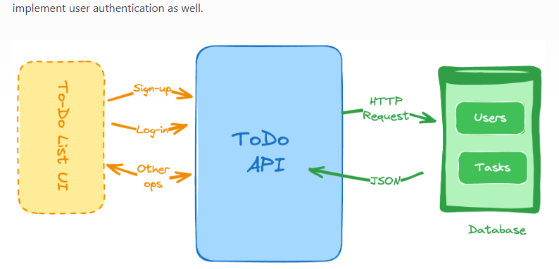
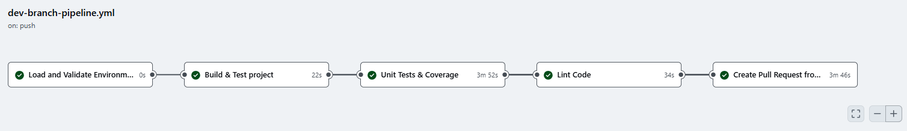

# Project description



In this project comes from [roadma.sh](https://roadmap.sh/). <br> I'm required to develop **a RESTful API to allow users to manage their to-do list.** The previous backend projects have only focused on the CRUD operations, but this project will require me to implement user authentication as well.


#### Image illustration


## Goals
Skills required for this project include:

* [ ] User authentication
* [ ] Schema design and Databases
* [ ] RESTful API design
* [ ] CRUD operations
* [ ] Error handling
* [ ] Security

## Requirements
I'm required to develop a **RESTful API with following endpoints**

* [ ] User registration to create a new user
* [ ] Login endpoint to authenticate the user and generate a token
* [ ] CRUD operations for managing the to-do list
* [ ] Implement user authentication to allow only authorized users to access the to-do list
* [ ] Implement error handling and security measures
* [ ] Use a database to store the user and to-do list data (you can use any database of your choice)
* [ ] Implement proper data validation
* [ ] Implement pagination and filtering for the to-do list

Given below is a list of the endpoints and the details of the request and response:

**User Registration**
Register a new user using the following request:
```sh
POST /register
{
  "name": "John Doe",
  "email": "john@doe.com"
  "password": "password"
}
```
This will validate the given details, make sure the email is unique and store the user details in the database. Make sure to hash the password before storing it in the database. Respond with a token that can be used for authentication if the registration is successful.
```sh
{
  "token": "eyJhbGciOiJIUzI1NiIsInR5cCI6IkpXVCJ9"
}
```

The token can either be a JWT token or a random string that can be used for authentication. We leave it up to you to decide the implementation details.

##### **User Login**
Authenticate the user using the following request:
```sh
POST /login
{
  "email": "john@doe.com",
  "password": "password"
}
```
This will validate the given email and password, and respond with a token if the authentication is successful.

```sh
POST /login
{
  "token": "eyJhbGciOiJIUzI1NiIsInR5cCI6IkpXVCJ9"
}
```

##### **Create a To-Do Item**
Create a new to-do item using the following request:
```sh
POST /todos
{
  "title": "Buy groceries",
  "description": "Buy milk, eggs, and bread"
}
```

User must send the token received from the login endpoint in the header to authenticate the request. You can use the Authorization header with the token as the value. In case the token is missing or invalid, respond with an error and status code 401.

```sh
{
  "message": "Unauthorized"
}
```
Upon successful creation of the to-do item, respond with the details of the created item.
```sh
{
  "id": 1,
  "title": "Buy groceries",
  "description": "Buy milk, eggs, and bread"
}
```
##### **Update a To-Do Item**
Update an existing to-do item using the following request:

[...] All the requirement are found [here](https://roadmap.sh/projects/todo-list-api)

##### Bonus
* [ ] Implement filtering and sorting for the to-do list
* [ ] Implement unit tests for the API
* [ ] Implement rate limiting and throttling for the API
* [ ] Implement refresh token mechanism for the authentication


---

<p align="center">
  <a href="http://nestjs.com/" target="blank"></a>
</p>


## Description

[](https://sonarcloud.io/summary/new_code?id=TheGreatJordach_Todo-List-APP)

<div style="align-items: center">


[](https://github.com/TheGreatJordach/Todo-List-APP/actions/workflows/dev-branch-pipeline.yml)
[](https://codecov.io/gh/TheGreatJordach/Todo-List-APP)
[](https://sonarcloud.io/summary/new_code?id=TheGreatJordach_Todo-List-APP)
[](https://sonarcloud.io/summary/new_code?id=TheGreatJordach_Todo-List-APP)
[](https://sonarcloud.io/summary/new_code?id=TheGreatJordach_Todo-List-APP)
[](https://sonarcloud.io/summary/new_code?id=TheGreatJordach_Todo-List-APP)
[](https://sonarcloud.io/summary/new_code?id=TheGreatJordach_Todo-List-APP)
[](https://sonarcloud.io/summary/new_code?id=TheGreatJordach_Todo-List-APP)
[](https://sonarcloud.io/summary/new_code?id=TheGreatJordach_Todo-List-APP)
[](https://sonarcloud.io/summary/new_code?id=TheGreatJordach_Todo-List-APP)
[](https://sonarcloud.io/summary/new_code?id=TheGreatJordach_Todo-List-APP)
[](https://sonarcloud.io/summary/new_code?id=TheGreatJordach_Todo-List-APP)

</div>

## CI / CD

> Dev workflow


[Nest](https://github.com/nestjs/nest) framework TypeScript starter repository.

## Installation

```bash
$ yarn install
```

## Running the app

```bash
# development
$ yarn run start

# watch mode
$ yarn run start:dev

# production mode
$ yarn run start:prod
```

## Test

```bash
# unit tests
$ yarn run test

# e2e tests
$ yarn run test:e2e

# test coverage
$ yarn run test:cov
```

## Support

Nest is an MIT-licensed open source project. It can grow thanks to the sponsors and support by the amazing backers. If you'd like to join them, please [read more here](https://docs.nestjs.com/support).

## Stay in touch

- Author - [Kamil Myśliwiec](https://kamilmysliwiec.com)
- Website - [https://nestjs.com](https://nestjs.com/)
- Twitter - [@nestframework](https://twitter.com/nestframework)

## License

Nest is [MIT licensed](LICENSE).
